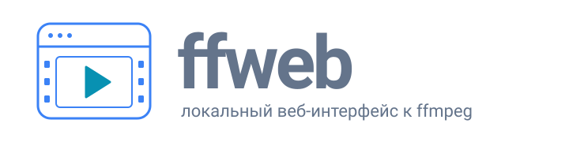
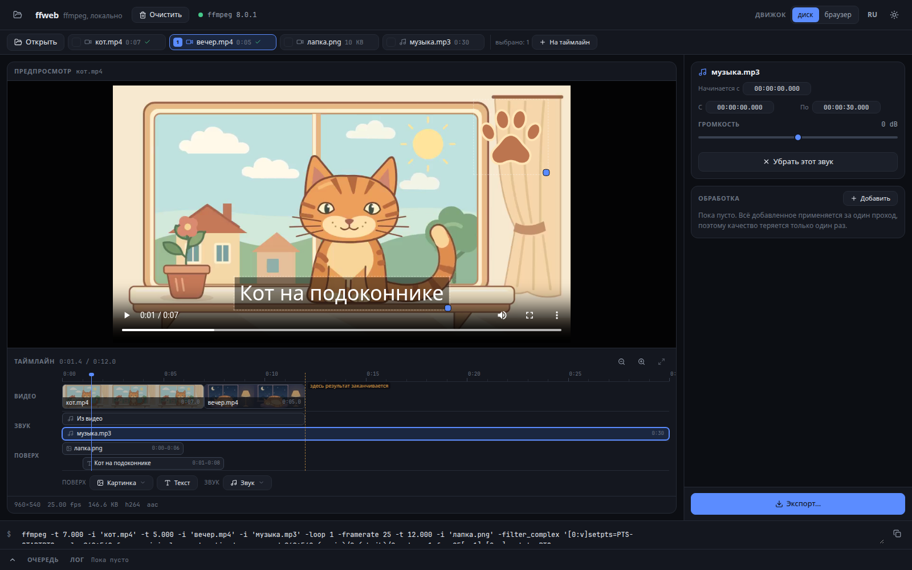
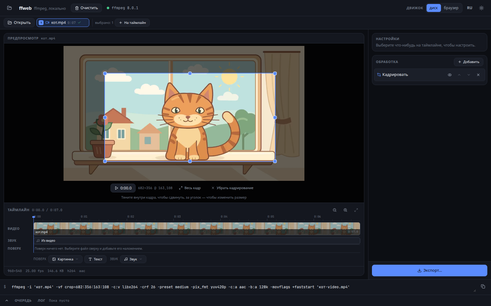
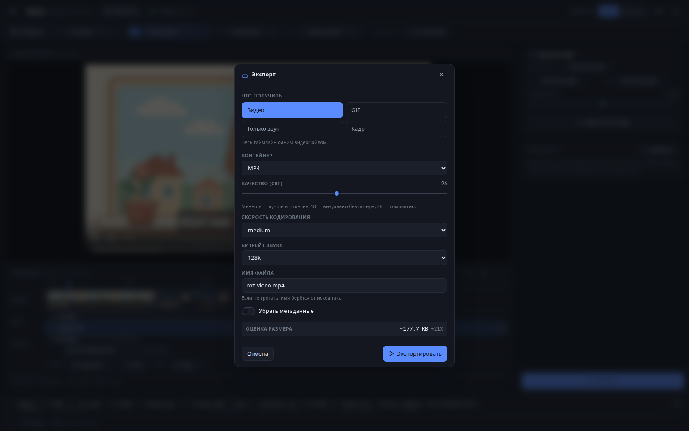
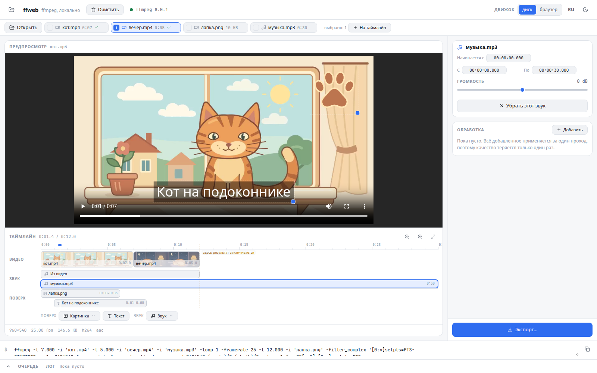

**ffweb** — видеоредактор, который открывается в браузере. Одна программа, один запуск:
вы вводите `ffweb`, открывается вкладка, и в ней можно резать, склеивать, накладывать
надписи и картинки, менять звук и сохранять результат.

Обработкой занимается [ffmpeg](https://ffmpeg.org). Собранная команда всегда видна внизу
экрана.



## Запуск

Возьмите готовый бинарник — в нём уже всё внутри — и запустите:

```
ffweb
```

Откроется браузер. Можно сразу с файлом или папкой:

```
ffweb ~/Видео/отпуск.mp4
ffweb ~/Видео
```

Результаты по умолчанию складываются в папку `ffweb-out` рядом. Другое место:

```
ffweb -o ~/Готовое
```

Если готового бинарника под вашу систему нет, соберите свой — понадобятся Rust и
Node.js:

```
make install
```

Флаги командной строки и внутреннее устройство —
в [документе для разработчиков](docs/РАЗРАБОТКА.md).

## Что можно сделать

### С роликом

| Что | Как |
| --- | --- |
| Отрезать начало и конец | потянуть блок за края на дорожке видео |
| Склеить несколько роликов | отметить файлы галочками и нажать «На таймлайн»; порядок галочек — порядок склейки |
| Поменять ролики местами | перетащить блок |
| Ускорить или замедлить | «Скорость» у выбранного блока |
| Пустить задом наперёд | «Задом наперёд» |
| Повторить несколько раз | «Повторить» |
| Туда и обратно | «Туда и обратно» |
| Вставить заставку между роликами | добавить картинку на дорожку видео — она станет отрезком в несколько секунд |

### Поверх картинки

| Что | Как |
| --- | --- |
| Наложить логотип или картинку | «Поверх» → «Картинка» |
| Написать текст | «Поверх» → «Текст»: свой размер, цвет и подложка |
| Наложить второй ролик | «Поверх» → «Картинка», выбрать видеофайл |
| Задать, когда появится и исчезнет | потянуть края блока или ввести время |
| Подвинуть и изменить размер | тянуть прямо на изображении |
| Сделать полупрозрачным | «Непрозрачность» |
| Положить несколько штук разом | каждое наложение получает свою строку |

### Звук

| Что | Как |
| --- | --- |
| Выключить свой звук ролика | «Без звука» на звуковой дорожке |
| Подложить музыку | «Звук» → выбрать файл; можно с любого момента |
| Добавить несколько звуков | каждый встаёт своей строкой, все смешиваются |
| Сделать тише или громче | «Громкость» |
| Выровнять громкость | «Выровнять громкость» |
| Сохранить звук отдельным файлом | «Сохранить дорожку отдельно» |

### Обработка изображения

| Что | Как |
| --- | --- |
| Кадрировать | «Обработка» → «Кадрировать»: рамка прямо на видео |
| Изменить размер или сжать | «Изменить размер» |
| Повернуть или отразить | «Повернуть» |
| Добавить поля под нужное соотношение сторон | «Соотношение сторон» |
| Яркость, контраст, насыщенность, гамма, ч/б | «Цвет» |
| Убрать шум | «Шумоподавление» |
| Добавить резкости или размыть | «Резкость и размытие» |

Все добавленные обработки складываются в одну цепочку и применяются за один проход.

### Что получить на выходе

| Что | Подробности |
| --- | --- |
| Видео | MP4, MKV, MOV, WebM; качество, скорость кодирования, битрейт звука |
| GIF | из того, что лежит на таймлайне |
| Только звук | MP3, M4A, WAV, FLAC, Opus, OGG |
| Один кадр | тот, на котором стоит курсор |

## Монтажный стол

Всё, из чего складывается результат, лежит на одной ленте времени, каждая дорожка
отвечает за своё.

**Склейка — это несколько блоков на дорожке видео.** Отдельной операции «склеить» нет:
отметили файлы, нажали кнопку — они встали на дорожку в этом порядке. Блок
перетаскивается, края тянутся; скорость, повторы и «задом наперёд» задаются на самом
блоке.

**Звук — дорожка, а не пункт меню.** Собственный звук ролика — одна строка, каждый
подложенный звук — своя. «Заменить музыку» — это выключенная строка ролика плюс один
добавленный звук; «добавить музыку с пятой секунды» — то же самое, только строку ролика
оставили включённой.

**Наложение занимает часть ленты, а не всю.** Логотип может появиться на третьей секунде
и исчезнуть к седьмой — потяните края его блока или впишите время. Наложений может быть
сколько угодно, каждое получает свою строку.

**Предпросмотр показывает результат до запуска:** логотип рисуется на своём месте,
подпись — своим размером, наложенный ролик — тем кадром, который придётся на этот момент.
Всё появляется и исчезает вместе с курсором, и всё это можно двигать и растягивать прямо
на изображении.



Кадрирование идёт по играющему видео, а не по стоп-кадру.

Лента приближается колесом с Ctrl. Ось тянется до всего, что на неё положили: музыка,
пережившая видео, нарисована во всю длину, а пунктир показывает, где результат кончится
и что дальше обрежется.

Кнопка **«Очистить»** убирает всё со стола — файлы, дорожки, настройки — и
останавливает то, что считается. Готовые файлы на диске она не трогает.

## Экспорт

Кнопка «Экспорт» спрашивает, что должно получиться.



Над видео появляется полоса с именем результата, его размером и путём на диске, кнопками
«Сохранить» и «Скопировать путь» и переключателем «Исходник / Результат». Одна и та же
задача, запущенная дважды, пишет `-2`, а не затирает прежний файл.

## Прочее

Интерфейс на русском и английском, тема светлая и тёмная.



Файлы читаются там, где лежат, — копий на диске не создаётся. Файл можно бросить в любое
место окна. Строка команды внизу правится вручную: можно дописать своё, кнопка возвращает
управление форме.

## Если ffmpeg не установлен

Всё считается прямо во вкладке браузера, только медленнее. Ставить ничего не нужно —
при первом запуске подтягивается всё необходимое.
