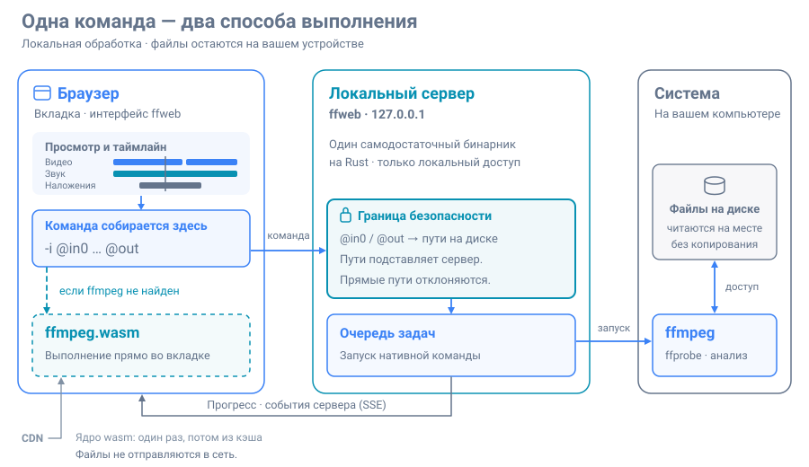

# Разработка

Техническая часть: как проект собран, как устроен внутри и чем проверяется. Обычному
пользователю всё это не нужно — ему хватит [README](../README.md).



## Требования

Готовому бинарнику для запуска не нужно ничего. ffmpeg 5 или новее включает нативный
движок; без него всё считается в браузере. Для сборки из исходников нужны Rust 1.82+ и
Node.js 20+.

## Сборка

`make` без аргументов перечисляет все цели.

| Цель | Что делает |
| --- | --- |
| `make build` | Отладочный бинарник вместе с интерфейсом |
| `make release` | Оптимизированный бинарник |
| `make install` | `cargo install` в `~/.cargo/bin` |
| `make run` | Собрать и запустить |
| `make dev` | Rust-сервер плюс Vite с горячей перезагрузкой |
| `make check` | Clippy, rustfmt, компилятор TypeScript и тесты |
| `make check-all` | То же плюс настоящий ffmpeg и браузер |
| `make test-ui` | Только тесты фронтенда |
| `make test-ops` | Каждая операция, выполненная настоящим ffmpeg |
| `make screenshots` | Переснять картинки для README |
| `make doctor` | Что найдено: ffmpeg, кодеки, состояние кэша |
| `make cache` | Скачать wasm-ядро заранее |
| `make clean` | Убрать результаты сборки (`distclean` — ещё и `node_modules`) |

`PORT`, `UI_PORT`, `HOST`, `ROOT`, `OUT` и `ARGS` переопределяют умолчания:

```
make run PORT=9000 ROOT=~/Видео OUT=~/Готовое
make dev PORT=9000 UI_PORT=5174
```

`make dev` отдаёт интерфейс из Vite с горячей перезагрузкой, пока настоящий Rust-сервер
обслуживает API; Vite проксирует `/api` и `/wasm` на указанный `PORT` и ставит те же
заголовки COOP/COEP, поэтому wasm-движок работает и там. Ctrl-C останавливает оба.

Внутри `build.rs` запускает сборку Vite, когда Node.js есть и исходники изменились, —
поэтому обычный `cargo build` тоже даёт полный бинарник. `FFWEB_SKIP_UI_BUILD=1`
пропускает этот шаг.

Собранный интерфейс **не хранится** в репозитории: он порождаемый, а порождаемый бандл
в репозитории кладёт диф с хешами в каждый коммит, трогающий фронтенд. Поэтому для
сборки из исходников нужен Node.js 20+. Машина без него всё равно соберёт: бинарник
запустится, API заработает, а страница скажет, что интерфейс не собран.

## Устройство репозитория

```
src/            бинарник и локальный сервер
  server/       по модулю на задачу: файлы, задачи, wasm, статика, доступ, ошибки
  jobs.rs       очередь: одна запись на запуск ffmpeg, с прогрессом и отменой
  paths.rs      через неё проходит каждый путь, пришедший от клиента
  validate.rs   что сервер согласен принять как аргументы ffmpeg
  caps.rs       что умеет ffmpeg на этой машине
web/src/
  core/         части, в которых нет интерфейса
    project.ts    что такое таймлайн: клипы, участки, звук, наложения, экспорт
    graph.ts      превращение проекта в один фильтрограф ffmpeg
    build.ts      вся команда: плоская, когда можно, и размеченная, когда нужно
    timeline.ts   где стоит блок и что делает его перетаскивание
    geometry.ts   видимое окно и рамка кадрирования
    waveform.ts   пики звука в столбцы нарисованной дорожки
    history.ts    отмена и возврат, обобщённые по типу значения
    shortcuts.ts  таблица горячих клавиш
  ops/          эффекты, как данные
  engines/      нативный (по HTTP) и wasm (во вкладке) за одним интерфейсом
  ui/           компоненты; один файл — одна вещь на экране
    timeline/     дорожки, живущие на общей оси
```

## Как это работает

Логика, превращающая операцию с её параметрами в список аргументов ffmpeg, лежит в
одном месте — `web/src/core/build.ts` и `web/src/ops/`, — и оба движка выполняют то, что
она выдала. Это и не даёт двум путям разойтись, и это же показывает строка команды.

Аргументы приходят на сервер с плейсхолдерами `@in0`, `@in1` и `@out`; настоящие пути
подставляет сервер. Прогресс берётся из собственного потока `-progress` ffmpeg, а не
выскабливается из stderr, и доезжает до браузера через server-sent events.

Страница кросс-доменно изолирована (COOP/COEP) — без этого браузер не даёт
`SharedArrayBuffer`, без которого не живёт wasm-ядро.

Со стороны wasm грузится **однопоточное** ядро. Изоляция есть и `SharedArrayBuffer`
доступен, но опубликованная многопоточная сборка 0.12.10 замирает после «Stream mapping»
и не возвращается. Добавьте `?core=mt` к адресу, чтобы всё-таки попробовать;
`ffweb cache fetch --all` её скачает.

### Аппаратное кодирование

`caps.rs` находит `h264_nvenc`, `h264_qsv`, `h264_vaapi` и родственные им, и отдаёт
список браузеру; диалог экспорта предлагает те, с которыми собран ffmpeg, а остальные
показывает отключёнными.

Выбор **явный**, а не автоматический, и причина в том, что `ffmpeg -encoders`
перечисляет кодировщик, если с ним *собран*, — это не то же самое, что наличие
драйвера. На машине, где nvenc работает, `h264_qsv` в том же списке падает с
«Error creating a MFX session: -9», и в этом сообщении нет ни слова о настройке,
которая к нему привела. Поэтому `core/jobs.ts` распознаёт такие отказы по тексту лога
и добавляет к ошибке одну строку — переключиться на программное кодирование.

Ни `-crf`, ни имена пресетов x264 железо не принимает: у nvenc это `-cq` и `p1..p7`,
у QSV — `-global_quality`, у videotoolbox — `-q:v` по совсем другой шкале. Перевод
живёт рядом с аргументами в `containers.ts`, чтобы интерфейсу было достаточно знать,
что кодировщик существует. Две ловушки записаны там же: без `-b:v 0` nvenc упирается
в битрейт по умолчанию и молча игнорирует `-cq`, а HEVC без `-tag:v hvc1` в mp4 и mov
не играет ни в чём от Apple.

VAAPI **сознательно не предлагается**: ему нужен
`-vaapi_device /dev/dri/renderD128` перед входом, а `validate.rs` отвергает любой
аргумент, начинающийся с `/`, — это тот самый слой, который не даёт странице назвать
путь. Плюс ему нужен `format=nv12,hwupload` на видео, что не сочетается с уже занятым
`-filter_complex`. Пустить его — значит проделать дыру в проверке путей ради одного
кодировщика; правильный путь, если он понадобится, — новый вид плейсхолдера, который
сервер подставляет сам, выбрав устройство (для чего `caps.hwaccels` и собирается).

### Волновая форма

`/api/peaks` отдаёт громкость файла числами, а дорожка рисует их на canvas —
не картинкой с сервера, иначе она не тянулась бы при зуме и не меняла бы цвет с
темой.

Звук расшифровывается в моно на 1000 отсчётов в секунду (2 кБ/с: двухчасовой фильм —
четырнадцать мегабайт, а не гигабайт) и **сворачивается на лету**, а не собирается
целиком. Загвоздка в том, что номер корзины зависит от того, сколько отсчётов окажется
всего, а это известно только в конце, — поэтому `Fold` держит фиксированное число
корзин и, когда они заполняются, вдвое огрубляет разрешение, сливая их попарно.
Слияние максимумов точно, так что ответ тот же, что и с целым звуком в руках, а память
не растёт.

Пики берутся один раз на файл и покрывают его целиком: зум читает более узкий срез уже
имеющегося массива, а не запрашивает заново. Исключение — сильный зум в длинный файл,
где общая мерка слишком груба; тогда запрашивается сам диапазон, и только когда окно
остановилось (`settledView`, дебаунс 180 мс).

Обе мерки хранятся **раздельно**, и `bestFor` выбирает между ними на каждую отрисовку.
Подробная описывает только тот диапазон, который запрашивали, поэтому годится, лишь пока
окно внутри неё; на откате масштаба надо возвращаться к общей. Один слот на обе давал
широкий вид, нарисованный узкой полоской звука с тишиной по бокам.

`ThumbCache` при этом стал `BlobCache` с каталогом и расширением: ключ не несёт в себе
пометки о том, чего он ключ, поэтому волна шириной 640 и кадр шириной 640 в одном
хранилище были бы одной записью. Разводит их каталог.

### Переходы между клипами

Единственная возможность, которая **меняет длину результата**, — и потому единственная,
ради которой пришлось свести воедино два независимых обхода раскладки. `clipStart` в
`project.ts` и `layout()` в `timeline.ts` считали одно и то же по-разному; пока
перекрытий не было, они совпадали. Теперь оба идут через `overlaps()`, и есть тест,
требующий, чтобы конец последнего блока в точности совпадал с `timelineDuration`.

Переход живёт **на клипе, в который переходим** (`Clip.transition`), а не отдельным
списком стыков: у стыка нет собственной личности, и массив рядом с клипами пришлось бы
чинить при каждой перестановке, удалении, добавлении и разрезе — а первый забывший
применил бы наплыв не к той паре, ничего не сказав.

`xfade` работает попарно, поэтому склейка становится левой свёрткой, а не одним общим
`concat`. Свёрток две, и это не аккуратность: у `acrossfade` нет `offset` вовсе —
он всегда сшивает хвост одного с головой другого, — так что делить обходам нечего.
Повторы внутри клипа склеиваются встык **до** свёртки: наплыв бывает между клипами, а
клип, растворяющийся в другом показе себя же, — не то, что значит «повторить трижды».

Две вещи, которые ловит только настоящий ffmpeg. `xfade` отвергает входы с разным
форматом пикселей — а фильтры холста его не фиксируют. И отвергает разные шкалы
времени: у клипа она от частоты кадров, а `xfade` отдаёт микросекунды, поэтому
расхождение вылезает только на **втором** наплыве подряд. Отсюда `format=yuv420p,settb=AVTB`
на каждом клипе — и только когда наплывы есть, чтобы обычная склейка осталась прежней
командой.

В `WASM_FILTERS` `xfade` **не добавлен**. Это список обещаний, а не проба: никто здесь
не проверял, везёт ли опубликованное браузерное ядро этот фильтр, и угадать неверно —
значит принять таймлайн и умереть посреди кодирования. Оставленный снаружи, он гасит
кнопку экспорта заранее — ровно как вжигаемые субтитры.

### Рабочее пространство и то, что из него берут

Таймлайн — **рабочее пространство**, а не результат. Клипы лежат на нём во всю свою
длину, что бы из них ни собирались оставить, а поверх отмечены **участки** (`ranges`) —
их и склеивает экспорт, в том порядке, в каком они лежат.

Раньше обрезка резала сам клип, поэтому таймлайн показывал результат и отрезанное с
него исчезало. Блок снова занимал всю ось, тянуть было некуда — участок можно было
только укоротить, и никогда обратно. У окна есть место с обеих сторон, потому что то,
из чего его вырезали, по-прежнему нарисовано под ним.

Всё, что строит команду, работает не с проектом, а с `forExport(project)`: он
превращает окна в клипы и раскладывает их встык, поэтому графу по-прежнему видна
обычная череда клипов, и участки учитываются ровно один раз, в одном месте. Когда
ничего не отмечено, `forExport` возвращает проект как есть — оттого нетронутый экспорт
даёт ту же плоскую команду, что и всегда, а все 352 фикстуры не сдвинулись.

Окно, попавшее на стык двух клипов, даёт по куску от каждого — это и значит «один
диапазон между двумя файлами». Клип с повторами или «туда и обратно» берётся целиком
либо никак: окно на его части должно было бы сказать, какой именно показ имеется в
виду, а честного ответа нет.

Наложения, звуки и кадр для стоп-кадра ставятся на **пространство**, то есть на то, что
видно, и переносятся в результат через `toResult`: всё, что стоит после выброшенного
куска, сдвигается на его длину.

## Тесты

Их 606, слоями, потому что одна и та же возможность ломается по-разному на разных
уровнях.

**Rust — 135 тестов.** `paths.rs` — та часть, через которую проходит каждый путь от
клиента, ей достаётся больше всех: `..`, симлинки наружу, соседний каталог, чьё имя
просто начинается так же, как корень, и выбор свободного имени вместо затирания
вчерашнего экспорта. `native.rs` покрывает разбор `-progress`, который питает каждый
процент в интерфейсе, включая отрицательную заглушку ffmpeg до первого кадра и его
`out_time_ms`, который на самом деле в микросекундах. `caps.rs` разбирает вывод
`ffmpeg -encoders/-filters/-muxers` из фикстур — формат, который под этим кодом уже
однажды менялся. `jobs.rs` покрывает очередь, отмену задачи и в ожидании, и на ходу, и
недописанный файл, который не должен пережить отмену. `dropbox.rs` покрывает временный
каталог, в том числе два экземпляра, не удаляющие файлы друг друга, и каталог,
оставшийся от исчезнувшего процесса. `tests/http.rs` поднимает настоящий сервер:
токены, кросс-доменную изоляцию, диапазонные запросы, ограничение путей и поток событий,
обязанный закрыться сам, когда задача кончилась, — и заодно проверяет, что сам набор
тестов ничего не оставляет в общем временном каталоге, чего он до этого делал по одному
каталогу на тест.

**Фронтенд — 377 тестов**, о них ниже.

**Настоящий ffmpeg — 41 тест**, по отдельной команде `make test-ops`.

**Сквозные — 53 теста.** `web/e2e/` запускает собранный бинарник, ведёт системный
Chrome и проходит весь путь: открыть файл, отметить на нём участок, отметить второй и
получить склейку, склеить три ролика, положить картинку с третьей по седьмую секунду,
написать на ней подпись, вставить титульную карточку между двумя роликами, подложить
другую звуковую дорожку, положить два звука в разные моменты, наплыв между клипами,
субтитры отдельной дорожкой, разрез клипа, кадрирование — и проверить каждый результат
на диске. Часть из них измеряет сам таймлайн: где на самом деле нарисован каждый блок,
попало ли превью наложения на картинку и меняется ли волна при зуме, — потому что
положение, которое получается в CSS, и пиксели на canvas — единственное, чего нельзя
подтвердить чтением кода.

Здесь же живёт единственная проверка охраны клавиатуры: тест печатает подпись со
словом на `s` и требует, чтобы таймлайн не оказался разрезан. Строка команды — это
всегда смонтированная `textarea`, поэтому каждая буквенная клавиша, взятая под
сочетание, — это буква, которую кто-то не сможет набрать; проверить это можно только
в настоящем браузере.

Слои фронтенда, по мере удаления от пользователя:

- **Модель** (`web/src/core/project.test.ts`, `timeline.test.ts`) — арифметика, на
  которой держится всё остальное. Сколько идёт клип после ускорения, реверса и повторов;
  где встаёт каждый блок и насколько его сдвигает наплыв; какой клип играет в данную
  секунду и в каком месте своего файла; что из пространства попадёт в результат и куда
  там переедет наложение; достаточно ли проект прост, чтобы обойтись без фильтрографа.
  Перетаскивание блока — это пиксели и указатели, самое трудное для проверки глазами,
  поэтому всё оно сведено сюда, к числам.

  Здесь же живёт правило, которое стоило дороже всего: **раскладку считает одна
  функция**. `clipStart` и `layout` когда-то обходили клипы порознь и совпадали ровно до
  тех пор, пока перекрытий не было; тест требует, чтобы конец последнего блока в
  точности равнялся длине, которую объявляет проект.
- **Отмена и клавиши** (`core/history.test.ts`, `shortcuts.test.ts`) — обе вещи сделаны
  данными, чтобы их можно было проверить без браузера: что жест схлопывается в один шаг,
  а два намерения — нет, и что ни одно сочетание клавиш не занято дважды.
- **Реестр** (`web/src/ops/registry.test.ts`) — эффекты являются данными, которые
  интерфейс отрисовывает единообразно, поэтому кривая запись даёт сломанную панель, а не
  ошибку компиляции. Идентификаторы, иконки, виды параметров, умолчания внутри
  собственных диапазонов, умолчания списков, действительно существующие среди вариантов,
  доступность на обоих движках и названия на обоих языках. Два правила здесь несущие:
  **никакой эффект не двигает ничего во времени** и **никакой эффект не трогает звук**.
  Первое позволяет наложению верить, что «с третьей секунды» значит то, что показывает
  таймлайн; второе держит громкость в одном месте.
- **Сборщик** (`web/src/ops/build.test.ts`) — во что превращается проект. Что одиночный
  нетронутый клип по-прежнему даёт ту же плоскую команду `-ss / -i / -vf`; что склейка
  сперва приводит все клипы к одному размеру, соотношению сторон и частоте кадров; что
  немой клип среди звучащих добивается тишиной, а не отменяет звук у всех; что `adelay`
  несёт `all=1`, а `amix` — `normalize=0`; что наложение масштабируется относительно
  кадра, каким тот к этому моменту стал, и рисуется *после* эффектов, чтобы
  кадрирование не срезало его.
- **Законность** (`web/src/ops/validity.test.ts`) — законна ли полученная команда *как
  ffmpeg*, а это не тот же вопрос, что «есть ли в ней нужные подстроки». Фильтрация
  потока, который вы же копируете; два фильтрографа на один выход; настройка кодировщика
  для потока, который только что отключён; `-map` на пад, которого граф не создаёт;
  опция входа, прицепленная не к тому входу; **пад, который граф производит, а никто не
  потребляет**. Матрица здесь важна не меньше правил: эти неисправности вылезают в
  *сочетаниях*, поэтому пятнадцать форм таймлайна проверяются против трёх цепочек
  эффектов, четырёх целей экспорта и каждого контейнера.
- **Договор с сервером** (`web/src/ops/export.test.ts` плюс
  `accepts_every_command_the_interface_generates` и
  `looks_for_every_filter_the_interface_can_need` на Rust) — аргументы составляет
  фронтенд, а запускать ли их, решает Rust-сервер, на другом языке. Правило, ужесточённое
  с одной стороны и не с другой, даёт интерфейс, который строит команды, а сервер их
  отвергает, и ни один тест по отдельную сторону этого не увидит. Поэтому фронтенд
  выписывает каждую команду, какую способен породить — их 352, — и каждый фильтр, какой
  может понадобиться проекту, а тесты на Rust читают эти два файла обратно.
- **Настоящий ffmpeg** (`web/src/ops/ops.ffmpeg.test.ts`) — проект может дать
  правдоподобный список аргументов, который ffmpeg затем отвергнет, и никакое сравнение
  строк этого не поймает. Каждый вид таймлайна собирается, подставляется так же, как
  подставляет сервер, и прогоняется на настоящих роликах нарочно разного размера,
  частоты кадров и частоты дискретизации. Среди них подпись со всеми символами, какие
  способны сломать фильтрограф, — это единственное место, где текст пользователя
  встречает сразу двух разборщиков. У каждого прогона есть потолок по времени: не
  ограниченный по длине вход-картинка — единственный способ для этой модели зависнуть, а
  не упасть, а зависание выглядит ровно как медленное кодирование.

Каждый новый набор проверяется мутацией: тест, который не падает от нарочно внесённой
ошибки, тестом не считается. Именно так был пойман `eof_action=pass` из раннего
черновика — ffmpeg его принимал, а все неподвижные наложения становились невидимыми.

## Картинки для README

Скриншоты сняты тестом, а не руками: `make screenshots` пересобирает все четыре. Тест
сам рисует котика (`web/e2e/fixtures/*.svg` → браузер → ffmpeg), поэтому не зависит ни
от сети, ни от чужих файлов, и кликает по названиям контролов — переименованная кнопка
ломает съёмку, и документация не может молча разойтись с интерфейсом.
